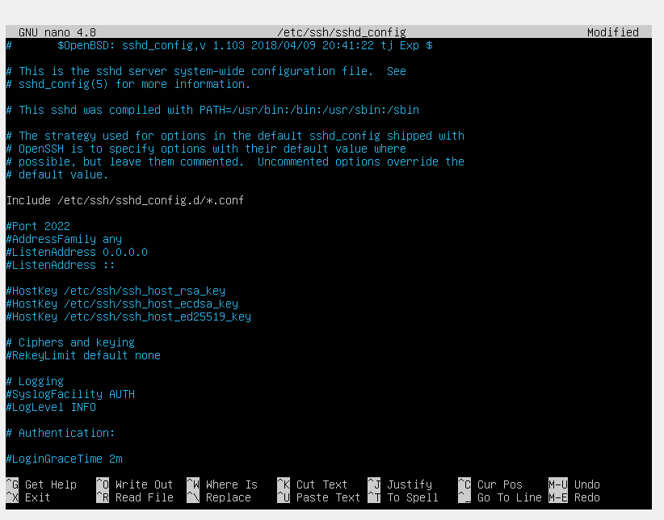

# Операционные системы UNIX/Linux (Базовый).

Установка и обновления системы Linux. Основы администрирования.

## Contents
1. [Установка ОС](#part-1-установка-ос)  
2. [Создание пользователя](#part-2-создание-пользователя)  
3. [Настройка сети ОС](#part-3-настройка-сети-ос)   
4. [Обновление ОС](#part-4-обновление-ос)  
5. [Использование команды  sudo](#part-5-использование-команды-sudo)  
6. [Установка и настройка службы времени](#part-6-установка-и-настройка-службы-времени)  
7. [Установка и использование текстовых редакторов](#part-7-установка-и-использование-текстовых-редакторов)  
8. [Установка и базовая настройка сервиса SSHD](#part-8-установка-и-базовая-настройка-сервиса-sshd)   
9. [Установка и использование утилит top, htop](#part-9-установка-и-использование-утилит-top-htop)   
10. [Использование утилиты fdisk](#part-10-использование-утилиты-fdisk)   
11. [Использование утилиты df](#part-11-использование-утилиты-df)    
12. [Использование утилиты du](#part-12-использование-утилиты-du)    
13. [Установка и использование утилиты ncdu](#part-13-установка-и-использование-утилиты-ncdu)    
14. [Работа с системными журналами](#part-14-работа-с-системными-журналами)     
15. [Использование планировщика заданий CRON](#part-15-использование-планировщика-заданий-cron)    

## Part 1. Установка ОС

- Для выполнения задачи необходимо в первую очередь установить программу для виртуализации VirtualBox.

- Далее в этой программе создаем виртуальную машину и устанавливаем заранее скаченную операционную систему Ubuntu 20.04 Server LTS без графического интерфейса.

- После установки проводим проверку наличия операционной системы на виртуальной машине:

|  |
|:-----------------------------------------:|
| *Вывод команды `cat /etc/issue`*            |

## Part 2. Создание пользователя

- Для создания нового пользователя потребуется ввести следующую команду:

|  |
|:-----------------------------------------:|
| *Вывод команды `sudo useradd -g adm hehehe`*            |

- просматриваем список что бы удостовериться в появлении нового пользователя:

|  |
|:-----------------------------------------:|
| *Вывод команды `cat /etc/passwd`*            |

## Part 3. Настройка сети ОС

- Задаем название машины:

|  |
|:-----------------------------------------:|
| *Задаем название машины*            |

- Устанавливаем временную зону:

|  |
|:-----------------------------------------:|
| *Устанавливаем временную зону*            |

- Выводим названия сетевых интерфейсов:

|  |
|:-----------------------------------------:|
| *Вывод команды `ifconfig`*            |

 lo - Петлевой интерфейс используется для коммуникации приложений на компьютере самим с собой, без обращения к физической сети. Когда приложение посылает данные на "lo", они передаются через сетевой стек операционной системы, проходя все уровни сетевых протоколов так же, как это происходило бы с данными, отправляемыми по сетевой карте.

- Для отображения IP адреса устройства на котором работаем от DHCP сервера необходимо воспользваться командой `sudo dhclient`:

|  |
|:-----------------------------------------:|
| *Вывод команды `sudo dhclient -v`*            |

 DHCP (Dynamic Host Configuration Protocol — протокол динамической настройки узла) — сетевой протокол, позволяющий сетевым устройствам автоматически получать IP-адрес и другие параметры, необходимые для работы в сети TCP/IP.

- Выводим внешний ip-адрес шлюза с помошью `curl ifconfig.me`:

|  |
|:-----------------------------------------:|
| *Вывод команды `curl ifconfig.me`*            |

Внешний IP адрес: 79.136.140.126

- Выводим внутренний ip-адрес шлюза с помошью `ip route | grep default`:

|  |
|:-----------------------------------------:|
| *Вывод команды `ip route I grep default`* |

Внутренний IP адрес: 10.0.2.2

- Задаем статичные настройки ip, gw, dns:

Заходим в конфигурацию netplan, используя `vim` и меняем конфигурацию.

Задаем статические настройки,  меняем `dhcp4: false`, ставим статический ip `adresses:10.0.2.12/24`

Создаем статический шлюз через `routes:via:10.0.2.2`, ставим dns сервера: `1.1.1.1` и `8.8.8.8`

|  |
|:-----------------------------------------:|
| *Файл по адресу `/etc/netplan/00-installer-config.yaml`* |

- Перезагрузка виртуальной машины. Проверка, что статичные сетевые настройки (ip, gw, dns) соответствуют заданным в предыдущем пункте

|  |
|:-----------------------------------------:|
| *Проверка* |

- Пингование хостов 1.1.1.1 и ya.ru:

## Part 4. Обновление ОС

- Дважды выполняем обновление ОС при помощи команды `sudo apt upgrade`.

После второй попытки выведется информация об отсутствии обновлений:

|  |
|:-----------------------------------------:|
| *Повторное выполнение команды `sudo apt upgrade`* |

## Part 5. Использование команды **sudo**

- "Sudo" (от англ. "superuser do") - это утилита в UNIX-подобных операционных системах, которая позволяет пользователям запускать команды с привилегиями суперпользователя или другого пользователя, обычно требующими специальных разрешений, таких как установка программ, управление системными сервисами и файлами.

При использовании "sudo" пользователи могут выполнить команды, которые в обычных условиях требуют привилегий суперпользователя, вводя свой пароль, что повышает безопасность по сравнению с постоянным входом в систему под суперпользователем.

- Предаставим разрешение пользователю, созданному в [Part 2](#part-2-создание-пользователя), на выполнение команды `sudo`:

|  |
|:-----------------------------------------:|
| *Предаставим разрешение пользователю* |

- Изменение hostname ОС от имени пользователя, созданного в пункте [Part 2](#part-2-создание-пользователя):

|  |
|:-----------------------------------------:|
| *Изменение hostname* |

## Part 6. Установка и настройка службы времени

- Выводим время нашего часового пояса:

|  |
|:-----------------------------------------:|
| *время нашего часового пояса* |

- Выводим подробную информацию о времени:

|  |
|:-----------------------------------------:|
| *подробная информация о времени* |

## Part 7. Установка и использование текстовых редакторов 

- устанавливаем редакторы VIM, NANO, MCEDIT:

|  |
|:-----------------------------------------:|
| *устанавливаем VIM, NANO, MCEDIT* |

### VIM

- Создаем файл VIM при помощи команды `VIM test_VIM.txt`, переключаемся в режим `-- INSERT --` и печатаем текст, сохраняем командой `:w` закрываем командой `:q`:

|  |
|:-----------------------------------------:|
| *работа с VIM* |

- Открываем файл VIM при помощи команды `VIM test_VIM.txt`, переключаемся в режим `-- INSERT --` редактируем текст и закрываем без сохранения командой `:q`:

|  |
|:-----------------------------------------:|
| *работа с VIM* |

- Открываем файл VIM при помощи команды `VIM test_VIM.txt`, переключаемся в режим `-- INSERT --`.  Пишем вместо никнейма «s21 School s21». Для поиска нужно нажать `ESC`, затем написать `/<слово>`:

|  |
|:-----------------------------------------:|
| *работа с VIM* |

- Для замены нужно нажать `ESC`, затем написать `:%s/<слово>/<на что заменить>`:

|  |
|:-----------------------------------------:|
| *работа с VIM* |

### NANO

- Открываем NANO печатаем текст и сохраняем `ctrl+s`, закрываем NANO при помощи `ctrl+x`:

|  |
|:-----------------------------------------:|
| *работа с NANO* |

- Открываем файл NANO при помощи команды `NANO test_NANO.txt` редактируем текст и закрываем без сохранения командой `ctrl+x` далее `N`:

|  |
|:-----------------------------------------:|
| *работа с NANO* |

- Открываем файл NANO при помощи команды `NANO test_NANO.txt` делаем поиск командой `ctrl+w`:

|  |
|:-----------------------------------------:|
| *работа с NANO* |

- Открываем файл NANO при помощи команды `NANO test_NANO.txt` делаем замену командой `ctrl+\`:

|  |
|:-----------------------------------------:|
| *работа с NANO* |

### MCEDIT

- Создаем файл MCEDIT при помощи команды `mcedit test_MCEDIT.txt`, печатаем текст, сохраняем `F2` закрываем `F10`:

|  |
|:-----------------------------------------:|
| *работа с MCEDIT* |

- Открываем файл MCEDIT при помощи команды `mcedit test_MCEDIT.txt`, печатаем текст, закрываем без сохранения `F10` далее `N`:

|  |
|:-----------------------------------------:|
| *работа с MCEDIT* |

- Открываем файл MCEDIT при помощи команды `mcedit test_MCEDIT.txt`, печатаем текст «s21 School 21», делаем поиск `F7`:

|  |
|:-----------------------------------------:|
| *работа с MCEDIT* |

- Открываем файл MCEDIT при помощи команды `mcedit test_MCEDIT.txt`, печатаем текст «s21 School 21», делаем замену `F4`:

|  |
|:-----------------------------------------:|
| *работа с MCEDIT* |

## Part 8. Установка и базовая настройка сервиса **SSHD**

- Устанавливаем SSHd при помощи команды `sudo apt install ssh`:

|  |
|:-----------------------------------------:|
| *Устанавливаем SSHd* |

- Запускаем автостарт при помощи команды `sudo systemctl enable ssh`:

|  |
|:-----------------------------------------:|
| *Автостарт SSHd* |

- Меняем порт на `2022` в файле конфигурации `/etc/ssh/sshd_config`:

|  |
|:-----------------------------------------:|
| *Меняем порт на `2022`* |

Сохраняем и перезапускаем службу **SSHd** (`sudo systemctl restart ssh`), чтобы изменения вступили в силу.

- Для показа наличия процесса sshd используем комбинацию команд `ps aux | grep sshd`

|  |
|:-----------------------------------------:|
| *Процесс sshd* |

Команда `ps` в Linux используется для отображения информации о текущих процессах. 

Ключ `aux`:

`a`: Отображает информацию о всех процессах на системе.

`u`: Выводит дополнительную информацию о каждом процессе, включая имя пользователя владельца процесса и время CPU, использованное этим процессом.

`x`: Отображает информацию о процессах, запущенных не только в текущем терминале, но и во всех остальных терминалах.

Команда `grep sshd` используется для фильтрации вывода команды `ps` и поиска строк, содержащих ключевое слово `sshd`.

- Перезагружаем систему `reboot` и ыполняем команду `netstat -tan`:

|  |
|:-----------------------------------------:|
| Вывод команды `netstat -tan`* |

Значение ключей в команде netstat `-tan`:

`-t`: Отображает только TCP-соединения.

`-a`: Отображает все активные соединения, как установленные, так и прослушиваемые.

`-n`: Отображает порты и IP-адреса в числовом формате, а не в символическом.

Значение каждого столбца вывода команды `netstat -tan`:

`Proto`: Протокол.

`Recv-Q`: Размер очереди приема.

`Send-Q`: Размер очереди отправки.

`Local Address`: Локальный IP-адрес и порт.

`Foreign Address`: Внешний IP-адрес и порт.

`State`: Состояние соединения.

Значение `0.0.0.0` в столбцах `Local Address` и `Foreign Address` означает, что SSHd привязан ко всем сетевым интерфейсам (включая localhost), а не к конкретному IP-адресу. Это позволяет подключаться к службе SSHd с любого доступного сетевого интерфейса на компьютере.

## Part 9. Установка и использование утилит **top**, **htop**

- Устанавливаем утилиту при помощи команды `sudo apt install procps htop`:

|  
|:-----------------------------------------:|
| *Устанавливаем htop* |

- Запускаем `top`:

    |  |
    |:-----------------------------------------:|
    | *Запускаем `top`* |

    - uptime - 36 min
  - количество авторизованных пользователей - 1 user
  - общую загрузку системы - 0.00, 0.00, 0.00
  - общее количество процессов - 123
  - загрузку cpu - 0.0
  - загрузку памяти - 183.5
  - pid процесса занимающего больше всего памяти(VIRT) - 1
  - pid процесса, занимающего больше всего процессорного времени(%CPU) - 786

- Запускаем `htop`:

      
     *Запускаем `htop`* 

    - сортировка по PID:

          
     *сортировка по PID* 

    - сортировка по PERCENT_CPU:

          
     *сортировка по PERCENT_CPU* 

    - сортировка по PERCENT_MEM:

          
     *сортировка по PERCENT_MEM* 

    - сортировка по TIME:

          
     *сортировка по TIME* 

    - фильтровация для процесса sshd:

          
     *фильтровация для процесса sshd* 

    - с процессом syslog, найденным, используя поиск:

          
     *поиск syslog* 

    - с добавленным выводом hostname, clock и uptime: 

          
     *с добавленным выводом hostname, clock и uptime* 

## Part 10. Использование утилиты **fdisk**

- Запуск команду `fdisk -l`

|  |
|:-----------------------------------------:|
| *Вывод команды `fdisk -l`* |

- название жесткого диска - `/dev/sda`
- размер жесткого диска - `25 Gib`
- количество секторов -`52428800 sectors`

Чтобы узнать размер swap используем команду `free -h`

|  |
|:-----------------------------------------:|
|  *Вывод команды  `free -h`*    |

- размер swap - `0B` 

## Part 11. Использование утилиты **df** 

- Запуск команы `df`

|  |
|:-----------------------------------------:|
| *Вывод команды `df`* |

- Для корневого раздела (/):
  - размер раздела - `11758760` 
  - размер занятого пространства - `2680180` 
  - размер свободного пространства - `8459472` 
  - процент использования - `25`
  - единица измерения - `килобайты`

- Запуск команду `df -Th`

|  |
|:-----------------------------------------:|
| *Вывод команды `df -Th`* |

- Для корневого раздела (/):
    - размер раздела - `12G` 
    - размер занятого пространства - `2.8G` 
    - размер свободного пространства - `8.1G` 
    - процент использования - `25` 
    - тип файловой системы  - `ext4` 

## Part 12. Использование утилиты **du**

- Запуск команды `du`

|  |
|:-----------------------------------------:|
| *Вывод команды `du`* |

- Вводим  `sudo du -sh --block-size=1 /var/log /var /home`

|  |
|:-----------------------------------------:|
|  *Вывод команды  `sudo du -sh --block-size=1 /var/log /var /home`*    |

- Вводим  `du -h /var/log/*`

|  |
|:-----------------------------------------:|
|  *Вывод команды  `du -h /var/log/*`*    |

## Part 13. Установка и использование утилиты **ncdu**

- Установка утилиты `ncdu` командой `sudo apt-get install ncdu`

- Вывод размеров папок /home, /var, /var/log

    - Размер /home

    

     *Размер /home* 

    - Размер /var

    

     *Размер /var* 

    - Размер /var/log

    

     *Размер /var/log* 

- Размеры примерно совпадают с полученными в [Part 12](#part-12-использование-утилиты-du).

## Part 14. Работа с системными журналами

- Просмотр системных журналов

Вводим `cat /var/log/dmesg cat /var/log/syslog cat /var/log/auth.log`

-   
  *Последняя успешняя авторизация*    

    - Время последней успешной авторизации - 19:51:55
    - имя пользователя - hehehe
    - метод входа в систему - ввод логина и пароля

- Перезапуск службы SSHd

|  |
|:-----------------------------------------:|
|  *Перезапуск службы SSHd*    |

- Cообщение о рестарте службы

|  |
|:-----------------------------------------:|
|  *Cообщение о рестарте службы*    |

## Part 15. Использование планировщика заданий **CRON**

- Запуск команды uptime через каждые 2 минуты

Открываем файл Crontab(`crontab -e`) и настроиваем запуск uptime каждые 2 минуты 

|  |
|:-----------------------------------------:|
|  *Натсройка запуска uptime в планировщике заданий **CRON***    |

- Наличие выполнений uptime

Смотрим в журналае строчки о выполнении;

Команада `grep "CRON" /var/log/syslog | grep "uptime"`

|  |
|:-----------------------------------------:|
|  *Наличие выполнений uptime*    |

- Список текущих заданий для CRON**

Команада `crontab -l`

|  |
|:-----------------------------------------:|
|  *Список текущих заданий для CRON*    |

- Удаление всех заданий из планировщика заданий**

Команада `crontab -r`

|  |
|:-----------------------------------------:|
|  *Удаление всех заданий и вывод списка текущих заданий для CRON*    |